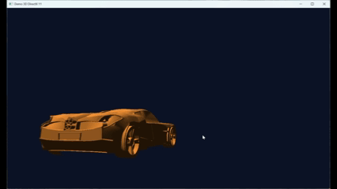
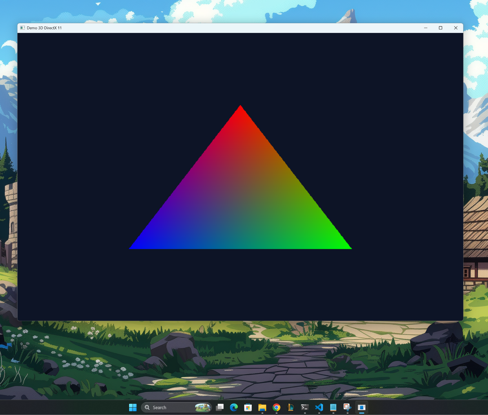
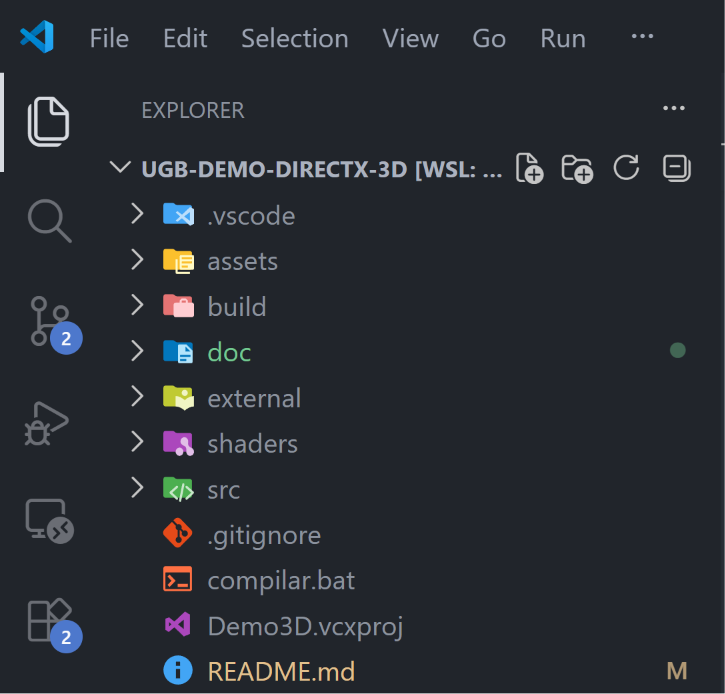
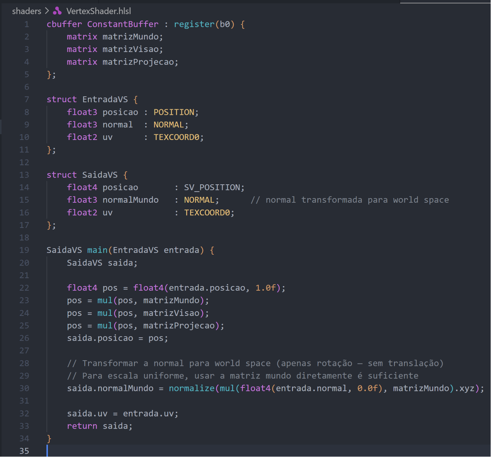
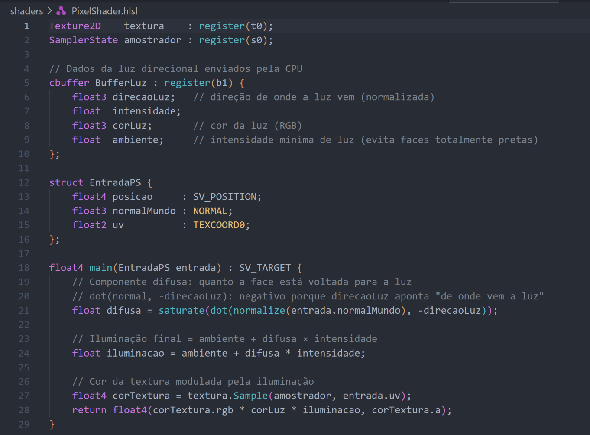

# Demo 3D DirectX 11

> Projeto acadêmico de Computação Gráfica — Tech Demo interativo 3D desenvolvido com DirectX 11 e C++ puro, sem engines ou frameworks de alto nível.


*Cena renderizada em tempo real: modelo OBJ externo com textura PNG e iluminação direcional de Lambert.*

---

## Sobre o Projeto

Este Tech Demo demonstra, na prática, os fundamentos do pipeline gráfico de baixo nível utilizando a API **Direct3D 11** da Microsoft. Toda a cadeia de renderização foi implementada manualmente em C++: inicialização do dispositivo gráfico, criação de buffers de vértices e índices, programação de shaders em HLSL, transformações com matrizes MVP, câmera FPS interativa, texturização e iluminação direcional.

O projeto foi desenvolvido em etapas incrementais — da janela vazia ao modelo 3D interativo — com documentação técnica registrada a cada etapa.

---

## Demonstração


*Vista lateral: a iluminação direcional de Lambert cria gradação de brilho nas faces do modelo conforme o ângulo em relação à luz.*


*Câmera próxima ao modelo: filtragem bilinear da textura visível nos detalhes.*

### Vídeo Demonstrativo

[](doc/images/video-demo.gif)
---

## Funcionalidades

| Categoria | Funcionalidade |
|---|---|
| **Renderização** | Pipeline DirectX 11 completo (IA → VS → RS → PS → OM) |
| **Modelos** | Carregamento de OBJ externos via TinyObjLoader |
| **Texturas** | Carregamento de PNG via stb_image, filtragem bilinear |
| **Iluminação** | Luz direcional com modelo difuso de Lambert + componente ambiente |
| **Câmera** | FPS interativa com WASD e setas do teclado |
| **Interatividade** | Trocar modelo, textura, eixo de rotação, posição, escala em runtime |

---

## Tecnologias

- **C++ 17** — linguagem principal
- **DirectX 11 (D3D11)** — API gráfica
- **HLSL** — shaders de vértice e pixel
- **Win32 API** — janela e entrada de teclado/mouse
- **Visual Studio 2022** — compilador e IDE
- **Windows SDK 10.0** — headers e libs DirectX

### Bibliotecas Externas

| Biblioteca | Uso | Tipo |
|---|---|---|
| [TinyObjLoader](https://github.com/tinyobjloader/tinyobjloader) | Carregamento de modelos OBJ | Header-only |
| [stb_image](https://github.com/nothings/stb) | Carregamento de texturas PNG | Header-only |
| DirectXMath | Vetores e matrizes (SIMD) | Parte do Windows SDK |

---

## Pré-requisitos

- Windows 10 ou Windows 11
- Visual Studio 2022 com workload **Desenvolvimento para Desktop com C++**
- Windows SDK 10.0 ou superior

---

## Como Compilar

**Opção 1 — Visual Studio (recomendado):**

```
1. Abrir Demo3D.vcxproj no Visual Studio 2022
2. Selecionar configuração: Debug | x64
3. Ctrl + Shift + B para compilar
```

**Opção 2 — Linha de comando (Developer PowerShell for VS):**

```powershell
.\compilar.bat
```

O script localiza o MSBuild automaticamente nas instalações do Visual Studio 2022 e 2019.

---

## Como Executar

```powershell
.\build\x64\Debug\Demo3D.exe
```

Ou pressione `F5` no Visual Studio para rodar com o debugger anexado.

> **Importante:** execute sempre a partir da raiz do projeto. O executável carrega os assets pelo caminho relativo `assets/models/` e `assets/textures/`.

---

## Controles

### Câmera

| Tecla | Ação |
|---|---|
| `W` | Mover câmera para frente |
| `S` | Mover câmera para trás |
| `A` | Mover câmera para esquerda |
| `D` | Mover câmera para direita |
| `← →` (setas) | Rotacionar câmera horizontalmente |
| `↑ ↓` (setas) | Rotacionar câmera verticalmente |

### Objeto — Rotação

| Tecla / Input | Ação |
|---|---|
| `R` | Ciclar eixo: **Y** → **X** → **Z** → **Combinado** → Y |
| Clique esquerdo | Pausar / retomar rotação automática |

### Objeto — Posição (Numpad)

| Tecla | Ação |
|---|---|
| `Num 4 / Num 6` | Mover em X (esquerda / direita) |
| `Num 8 / Num 2` | Mover em Z (frente / trás) |
| `Num 9 / Num 3` | Mover em Y (cima / baixo) |

### Objeto — Escala

| Tecla | Ação |
|---|---|
| `=` | Aumentar escala |
| `-` | Diminuir escala |

### Cena

| Tecla | Ação |
|---|---|
| `T` | Próxima textura (cicla os PNGs de `assets/textures/`) |
| `M` | Próximo modelo (cicla os OBJs de `assets/models/`) |
| `ESC` | Fechar a aplicação |

> Ao trocar de modelo com `M`, posição, escala e ângulo de rotação são resetados automaticamente.

---

## Adicionando Conteúdo

O Demo carrega automaticamente todos os arquivos das pastas de assets na inicialização — sem necessidade de recompilar.

### Modelos

Adicione arquivos `.obj` em `assets/models/`. O modelo deve ter normais e UVs exportados. No Blender: **File → Export → Wavefront (.obj)** com as opções *Write Normals* e *Include UVs* marcadas.

### Texturas

Adicione arquivos `.png` em `assets/textures/`.

> Modelos e texturas são carregados em **ordem alfabética** pelo nome do arquivo.

---

## Evolução do Projeto

O projeto foi construído em 7 etapas incrementais:


| Etapa | Resultado | Screenshot |
|---|---|---|
| 1 — Janela + DirectX | Tela azul escuro com render loop |  |
| 2 — Triângulo | Primeiro draw call via pipeline D3D11 |  |
| 3 — Cubo 3D | Index buffer, matrizes MVP, delta time |  |
| 4 — Câmera FPS | Navegação interativa com WASD e setas |  |
| 5 — Texturização | PNG mapeado via UVs com stb_image |  |
| 6 — Iluminação | Lambert difusa + componente ambiente |  |
| 7 — Modelo OBJ | TinyObjLoader com reindexação de vértices |  |

---

## Features Interativas


*Tecla M: alterna entre todos os modelos OBJ encontrados em `assets/models/`.*


*Tecla T: alterna entre todas as texturas PNG encontradas em `assets/textures/`.*


*Tecla R: cicla o eixo de rotação entre Y (padrão), X (tomba), Z (rola) e Combinado.*

---

## Estrutura do Projeto

```
/
├── src/
│   ├── main.cpp           → ponto de entrada WinMain
│   ├── Aplicacao.h/cpp    → orquestrador: loop, entrada, cena
│   ├── Janela.h/cpp       → janela Win32
│   ├── Renderizador.h/cpp → pipeline DirectX 11, draw calls
│   ├── Camera.h/cpp       → câmera FPS (yaw/pitch, WASD)
│   ├── Modelo.h/cpp       → carregamento OBJ + world matrix
│   ├── Malha.h/cpp        → vertex/index buffers genéricos
│   └── Textura.h/cpp      → carregamento PNG → GPU
├── shaders/
│   ├── VertexShader.hlsl  → transformação MVP + normais para world space
│   └── PixelShader.hlsl   → texturização + iluminação de Lambert
├── assets/
│   ├── models/            → adicione arquivos .obj aqui
│   └── textures/          → adicione arquivos .png aqui
├── external/
│   ├── tinyobjloader/     → tiny_obj_loader.h
│   └── stb/               → stb_image.h
├── doc/
│   ├── images/            → screenshots e vídeo demonstrativo
│   ├── etapa1-janela-e-directx.md
│   ├── etapa2-triangulo-colorido.md
│   ├── etapa3-cubo-3d.md
│   ├── etapa4-camera-fps.md
│   ├── etapa5-texturizacao.md
│   ├── etapa6-iluminacao.md
│   ├── etapa7-modelo-obj.md
│   ├── analise-renderizacao-texto-hud.md
│   └── relatorio-tecnico-academico.md
├── build/                 → binários gerados (ignorado no git)
├── compilar.bat           → build via linha de comando
└── Demo3D.vcxproj         → projeto Visual Studio
```


*Organização do repositório: separação clara entre código-fonte, shaders, assets, dependências e documentação.*

---

## Shaders HLSL

O projeto implementa dois shaders programáveis em HLSL:


*Vertex Shader: aplica transformações MVP (Model → World → View → Clip space) e converte normais para world space.*


*Pixel Shader: amostra a textura e calcula iluminação difusa de Lambert com componente ambiente.*

---

## Documentação Técnica

A pasta `doc/` contém:

| Arquivo | Conteúdo |
|---|---|
| [etapa1-janela-e-directx.md](doc/etapa1-janela-e-directx.md) | Win32, D3D11, swap chain, render loop |
| [etapa2-triangulo-colorido.md](doc/etapa2-triangulo-colorido.md) | Vertex buffer, shaders, draw call |
| [etapa3-cubo-3d.md](doc/etapa3-cubo-3d.md) | Index buffer, matrizes MVP, delta time |
| [etapa4-camera-fps.md](doc/etapa4-camera-fps.md) | Yaw/pitch, LookAt, produto vetorial |
| [etapa5-texturizacao.md](doc/etapa5-texturizacao.md) | stb_image, Texture2D, SRV, SamplerState |
| [etapa6-iluminacao.md](doc/etapa6-iluminacao.md) | Normais, Lambert difusa, cbuffer PS |
| [etapa7-modelo-obj.md](doc/etapa7-modelo-obj.md) | TinyObjLoader, reindexação, Malha |
| [analise-renderizacao-texto-hud.md](doc/analise-renderizacao-texto-hud.md) | Análise técnica de HUD: ImGui vs DirectWrite vs Atlas |
| [relatorio-tecnico-academico.md](doc/relatorio-tecnico-academico.md) | Relatório acadêmico completo (Partes 1 e 2) |

---

## Equipe

- Diego Goes
- Gutemberg
- Júlio
- Hugo
- Thomas

---

## Referências

- **Luna, Frank D.** — *Introduction to 3D Game Programming with DirectX 11*. Mercury Learning, 2012.
- **Microsoft Docs** — [Direct3D 11 Programming Guide](https://learn.microsoft.com/en-us/windows/win32/direct3d11/)
- **Microsoft Docs** — [HLSL Language Reference](https://learn.microsoft.com/en-us/windows/win32/direct3dhlsl/)
- **TinyObjLoader** — https://github.com/tinyobjloader/tinyobjloader
- **stb_image** — https://github.com/nothings/stb
